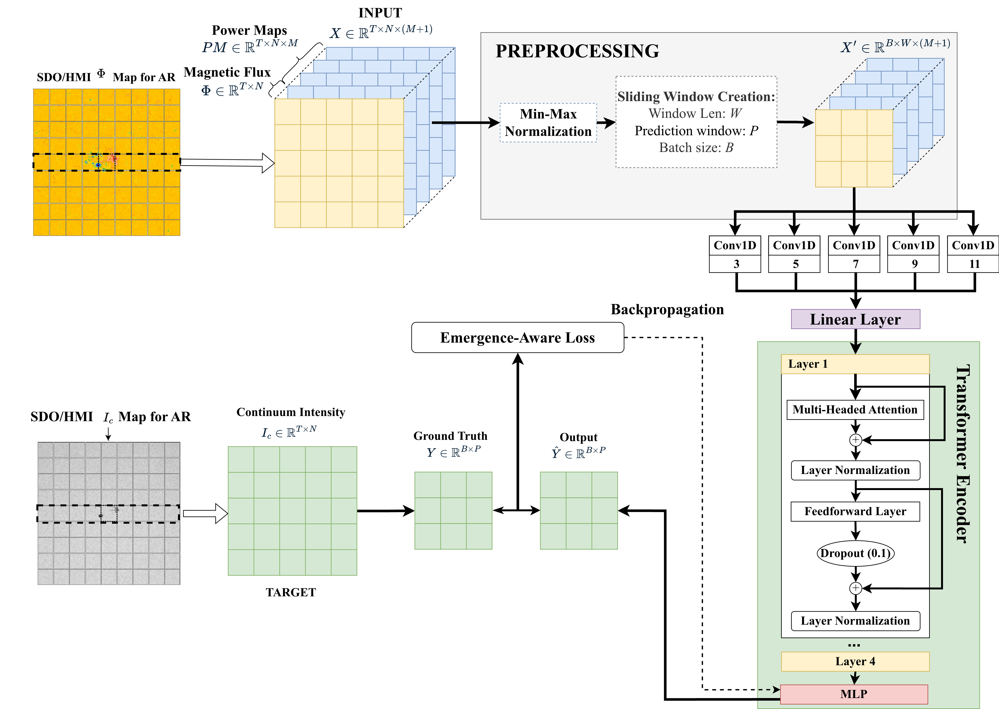

# AR Emergence Transformers

Transformer-based forecasting of continuum intensity for early detection of solar active region (AR) emergence using SDO/HMI data. This repository contains the code, pre-trained models, and evaluation tools for the paper:

> **"Forecasting Continuum Intensity for Solar Active Region Emergence Prediction using Transformers"** (under review)

This work presents a systematic ablation study evaluating Transformer architectures for predicting AR emergence, achieving a **10.6% improvement in RMSE** and **4.73 hours advance warning** compared to LSTM baselines.

## Model Architecture



**Figure 1**: End-to-end pipeline for predicting continuum intensity decrease during AR emergence. The model processes SDO/HMI magnetic flux (Φ) map cut-outs and acoustic power maps, forming a feature tensor X. Input sequences are created using sliding windows of length W = 110 with P = 12 prediction targets. The encoder-based Transformer architecture processes these sequences through multi-scale 1D convolutions and multi-head attention layers to predict continuum intensity evolution Ŷ. The model is trained with an emergence-aware loss function that combines MSE, early detection rewards, and derivative-based penalties.

## Key Results

- **Best Model**: EarlyDetect (no Conv1D) - RMSE: 0.1189, Timing: -4.73h (early detection)
- **5 Models Evaluated**: LSTM Baseline, Baseline, Baseline+Conv1D, EarlyDetect, EarlyDetect+Conv1D
- **Test Set**: 5 held-out active regions (ARs 11698, 11726, 13165, 13179, 13183)
- **Dataset**: SolARED - 46 ARs from SDO/HMI (41 train/val, 5 test)

## Experimental Design

This work presents a **factorial ablation study** (2×2 design) evaluating:

1. **Conv1D Front-end**: Temporal 1D convolutional layer (Yes/No)
2. **Architecture Type**: Standard Transformer vs. Early Detection Transformer

**Result**: 4 Transformer configurations + LSTM baseline = 5 total models

**Key Findings:**
- Early Detection architecture is the most critical factor for early prediction
- Conv1D front-end was found to be detrimental to performance
- Best model: EarlyDetect (no Conv1D) achieves 4.73h advance warning

## Installation

```bash
# Clone the repository
git clone <repository-url>
cd ar-emergence-transformers

# Install dependencies
pip install -r requirements.txt
```

**Requirements:**
- Python 3.10+
- PyTorch (CUDA recommended for speed)
- See `requirements.txt` for complete list

## Quick Start

### 1. Data Download

Data can be downloaded from the [SolARED Portal](https://sun.njit.edu/sarportal/):
- Visit https://sun.njit.edu/sarportal/
- Download data for test ARs: 11698, 11726, 13165, 13179, 13183
- Convert to `.npz` format (see [`docs/DATA_FORMAT.md`](docs/DATA_FORMAT.md))

Organize your data files in this structure:
```
/path/to/your/data/
├── AR11698/
│   ├── mean_pmdop11698_flat.npz
│   ├── mean_mag11698_flat.npz
│   └── mean_int11698_flat.npz
├── AR11726/
│   └── ...
└── ... (other ARs)
```

### 2. Evaluation (Using Pre-trained Checkpoints)

If you want to directly use the pre-trained checkpoints provided in this repository:

```bash
cd scripts/eval
python evaluate_all_experiments.py \
  --data_path /path/to/your/data \
  --output_dir ../../results \
  --test_ars 11698 11726 13165 13179 13183
```

**Outputs:**
- PDF plots: `results/unified_evaluations/pdf/AR{AR}_all_models_comparison.pdf`
- CSV metrics: `results/unified_evaluations/csv/all_ARs_metrics.csv`
- Timing table: `results/unified_evaluations/csv/all_ARs_emergence_timing_table.csv`

### 3. Training (Retrain from Scratch)

To retrain models from scratch, see the [Training](#training) section below.

## Repository Structure

```
ar-emergence-transformers/
├── scripts/
│   ├── data/          # Data loaders
│   ├── models/        # Model definitions (LSTM, Baseline, EarlyDetect)
│   ├── train/         # Training scripts
│   ├── eval/          # Evaluation script
│   └── metrics/       # Metric calculation helpers
├── models/checkpoints/  # Pre-trained model weights
│   ├── lstm_baseline.pth
│   ├── baseline_no_conv1d.pth
│   ├── baseline_conv1d.pth
│   ├── earlydetect_no_conv1d.pth
│   ├── earlydetect_conv1d.pth
│   └── configs/       # Hyperparameter configs
├── comparison/        # Model complexity profiling
├── docs/              # Documentation
└── slurm/             # SLURM job scripts (HPC)
```

## Models

### Pre-trained Checkpoints

All 5 models are available as pre-trained checkpoints:

- **LSTM Baseline**: `models/checkpoints/lstm_baseline.pth` (184.6K parameters)
- **Baseline**: `models/checkpoints/baseline_no_conv1d.pth` (5.0M parameters)
- **Baseline+Conv1D**: `models/checkpoints/baseline_conv1d.pth` (5.6M parameters)
- **EarlyDetect**: `models/checkpoints/earlydetect_no_conv1d.pth` (5.8M parameters) ⭐ **Best**
- **EarlyDetect+Conv1D**: `models/checkpoints/earlydetect_conv1d.pth` (19.1M parameters)

Hyperparameter configurations are in `models/checkpoints/configs/`.

### Model Architectures

- **LSTM**: 3-layer LSTM with 64 hidden units
- **Baseline Transformer**: Standard Transformer with relative positional encoding
- **EarlyDetect Transformer**: Early Detection architecture with attention biases and timing-aware loss

See paper Section 2.2 for detailed architecture descriptions.

## Training

To retrain models from scratch:

```bash
# Baseline (no Conv1D)
python scripts/train/baseline_train.py \
  --data_path /path/to/data \
  --output_dir results/baseline \
  --max_trials 32 \
  --epochs 1000 \
  --seed 42

# EarlyDetect (no Conv1D)
python scripts/train/earlydetect_train.py \
  --data_path /path/to/data \
  --output_dir results/earlydetect \
  --max_trials 16 \
  --epochs 1000 \
  --seed 42
```

See [`docs/REPRODUCIBILITY.md`](docs/REPRODUCIBILITY.md) for full training instructions.

## Evaluation Metrics

The evaluation script computes metrics matching the paper (Section 2.3):

1. **Overall RMSE**: Root Mean Squared Error (normalized for summary, denormalized for per-AR)
2. **Timing Difference (ΔT)**: Emergence detection timing (hours)
   - Negative = early prediction, Positive = late prediction
   - Threshold: derivative < -0.01 for k=4 consecutive hours
3. **Emergence RMSE**: RMSE within 24-hour emergence window
4. **Model Complexity**: Parameters, FLOPs, Memory, Inference Time

## Documentation

- **[Quick Start Guide](docs/QUICKSTART.md)**: Get started in 5 minutes ⚡
- **[Data Format & Download](docs/DATA_FORMAT.md)**: Data structure, format, and SolARED download instructions
- **[Reproducibility Guide](docs/REPRODUCIBILITY.md)**: Step-by-step guide to reproduce paper results
- **[Model Complexity](comparison/README.md)**: Profiling and complexity analysis

## Citation

If you use this code or models, please cite:

```bibtex
@article{tirona2025forecasting,
  title={Forecasting Continuum Intensity for Solar Active Region Emergence Prediction using Transformers},
  author={Tirona, Jonas and Patil, Sarang and Kasapis, Spiridon and Dogan, Eren and Stefan, John and Kitiashvili, Irina N. and Kosovichev, Alexander G. and Xu, Mengjia},
  journal={Journal of Geophysical Research: Machine Learning and Computation},
  year={2025},
  note={under review}
}
```

**Dataset Citation:**
```bibtex
@article{kasapis2025,
  title={SolARED: Solar Active Region Emergence Dataset},
  author={Kasapis, S. and Kitiashvili, I. N. and Kosovichev, A. G. and Stefan, J. T.},
  journal={ApJS},
  year={2025},
  note={under review}
}
```

## Data Source

The data used in this paper comes from the **SolARED (Solar Active Region Emergence Dataset)**:
- **Portal**: https://sun.njit.edu/sarportal/
- **Dataset**: 50 ARs from SDO/HMI (2010-2023)
- **Format**: 1D tile-averaged timelines of acoustic power, magnetic flux, and continuum intensity
- **Reference**: Kasapis et al. (2025)

See [`docs/DATA_FORMAT.md`](docs/DATA_FORMAT.md) for download and format details.

## Notes

- **SLURM Scripts**: Templates in `slurm/` need customization for your HPC environment
- **Data**: Large datasets excluded; download from SolARED portal or provide your own
- **Reproducibility**: Use exact package versions in `requirements.txt`
- **Hardware**: GPU recommended but not required (CPU mode available)

## License

See [LICENSE](LICENSE) file for details.
